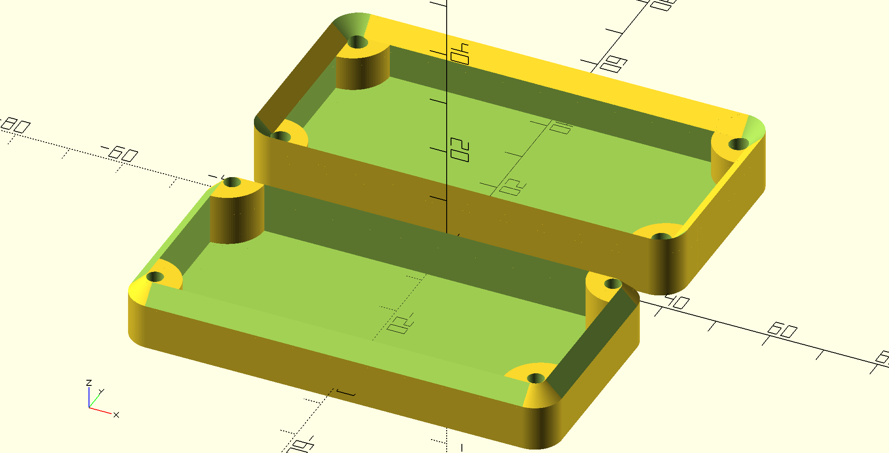

Parametric Case Model
=====================

    lower = [80, 40, 10];
    upper = [80, 40, 10];
    case_both_parts(lower, upper, wall=3, corner=5, screw=3);

usage
-----

In your source file use the command `use <case/case.scad>` to import the
module.

The modules have the signature:

- `case_lower_part(dimensions, wall=3, lid=2, corner=5, screw=3, screw_wall=3)`
- `case_upper_part(dimensions, wall=3, lid=2, corner=5, screw=3, screw_wall=3, screw_head_dia=5.5, screw_head_height=3)`

Description of the parameters:

- `dimensions`:       vector for [length, width, height], same as in cube()
- `wall`:             wall size of the box  [default=3]
- `lid`:              thickness of the floor or ceiling  [default=2]
- `corner`:           corner radius of the box  [default=5]
- `screw`:            diameter of the screw  [default=3, as in M3]
- `screw_wall`:       minimum thickness of material around the screw  [default=3]
- `screw_head_dia`:   diameter of the screw head  [default=5.5, for a M3]
- `crew_head_height`: height of the screw head, [default=3.5, for a M3]
