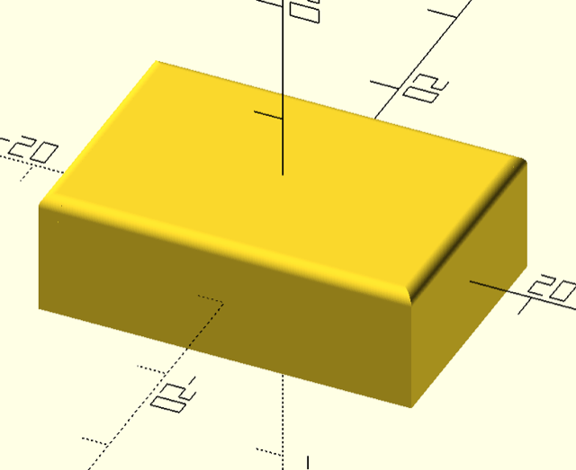

Create Cubes with chamfered edges
=================================

Main module:

    chamfered_cube(cube_size, radius, edges=[0:11], center=false)

It is important to understand the numbering of the edges:

          +--------- 10 ---------+
         /|                     /|
        / |                    / |
      11  |                   9  |
      /   |                  /   |
     /    |                 /    |
    +---------- 8 ---------+     |
    |     |                |     |
    |     |                |     |
    |     7                |     6
    |     |                |     |
    |     |                |     |
    |     |                |     |
    |     |                |     |
    |     |                |     |
    4     |                5     |
    |     |                |     |
    |     |                |     |
    |     +---------– 2 ---|-----+
    |    /                 |    /
    |   /                  |   /
    |  3                   |  1
    | /                    | /
    |/                     |/
    +---------- 0 ---------+

A call to `chamfered_cube([30, 20, 10], 1, edges=[8:11])` will give you a
cube with the size of 10 x 20 x 30, the upper side will have chamfers.

usage
-----

In your source file use the command `use <chamfer/chamfer.scad>` to import the
module.

The modules has the signature:

`chamfered_cube(cube_size, radius, edges=[0:11], center=false)`

- `cube_size`: the size of the cube [x, y, z]
- `radius`: the radius of the chamfer
- `edges`: list or iterator, defines on which cube edges the chamfers are applied
- `center`: center the cube around [0, 0, 0]

