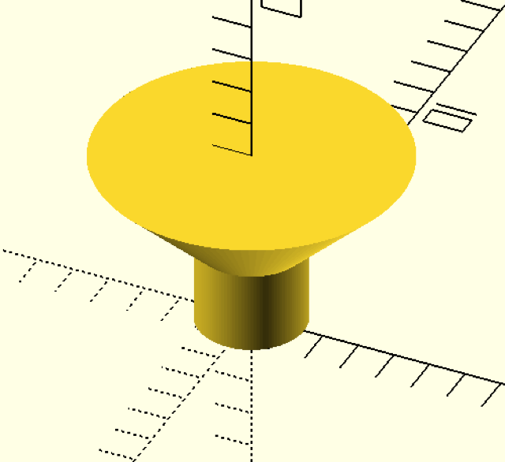

screw measurements and helpers
==============================

Cylinder screws
---------------

Standard DIN screws with a cylindric head.

Please use function cylinder_screw() to retrieve the basic dimensions as a vector:

Indexes in the vector:

 0. name
 1. shaft diameter
 2. head diameter
 3. shank diameter
 4. head height

Example:

    result = get_screw("M3");

    result == [
        "M3",   // name
        3,      // shaft diameter
        5.5,    // head diameter
        3       // head height
    ];

Mostly you'd want a hole for a screw: `cylinder_screw_bore_hole(size, length, head=true, slack=0, elongate_head=1)`:

    size:           screw size like "M3"
    length:         length of the screw, including head
    head:           include screw head
    slack:          add this size to the hole diameters (shaft and head)
    elongate_head:  add this extra length to the head

The screw will be centered on x and y axis. On the z-axis it is centered
according to the length of the screw, so excluding the elongated head
as specified by parameter.

Spax
----

Use function `spax(size)` to get a vector with spax measurements, at least for
the more interesting head ;-)

Indexes in the vector:

 0. thread size
 1. head diameter
 2. core diameter
 3. shank diameter
 4. head height
 5. thread pitch
 6. height max length

The available spax sizes are 2.5, 3, 3.5, 4, 4.5, 5, 6 and 7.

Mostly you'd want a hole for a screw: `spax_bore_hole(size, total_height=0)`
If total_height is set to 0, the height of the head will be used

usage
-----

In your source file use the command `use <screws/spax.scad>` or
`use <screws/cylinder_screws.scad>` to import the module you need.
