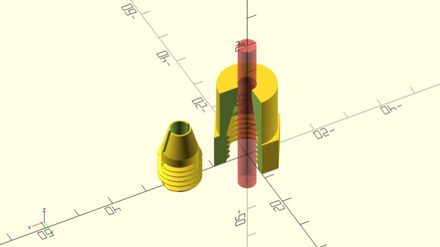

Shaft Screw Coupling
====================

This library provides a simple coupling mechanism to connect 3D models to round
shafts.

There a two modules for a screw coupling:

1. `fitting()` for the inner part. Connect your other 3D stuff to this.
2. `sleve()` for the outer part. This should be screwed tight to the fitting.

If you just `import` the module, you will see the example as above.

usage
-----

The module is based on the [threadlib][tl] project by Adrian Schlatter, so you
need to install this first into your library folder.

In your source file use the command `use <shaft-screw-coupling/coupling.scad>`
to import the two modules.

The two modules have the same signature:

`fitting(shaft_diameter, turns=3, higbee_arc=30, shaft_wall=2, slope=15, wall_min=0.5, cut=1)`

`sleve(shaft_diameter, turns=3, higbee_arc=30, shaft_wall=2, slope=15, wall_min=.5, cut=1)`

- `shaft_diameter`: diameter of the shaft to couple to
- `turns`: number of screw turns
- `higbee_arc`: the slope the screw starts with
- `shaft wall`: thickness around the shaft before the thread starts
- `slope`: slope of the cone
- `wall_min`: thickness of the wall around the shaft at the end of cone
- `cut`: width of the cut in the cone

The two arguments `wall_min`, `cut` have only meaning in the `fitting()`
module – in the `sleve()` module they are only present to give the module the
same signature.

[tl]: https://github.com/adrianschlatter/threadlib
