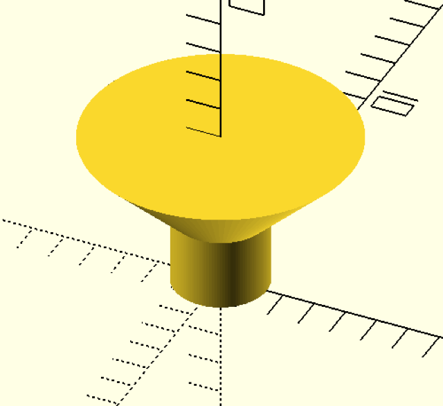

SPAX screw measurements and helpers
===================================

Use function `spax(size)` to get a vector with spax measurements, at least for
the more interesting head ;-)

Indexes in the vector:

 0. thread size
 1. head diameter
 2. core diameter
 3. shank diameter
 4. head height
 5. thread pitch
 6. height max length

The available spax sizes are 2.5, 3, 3.5, 4, 4.5, 5, 6 and 7.

Mostly you'd want a hole for a screw: `spax_bore_hole(size, total_height=0)`
If total_height is set to 0, the height of the head will be used

usage
-----

In your source file use the command `use <spax/spax.scad>` to import the
module.
