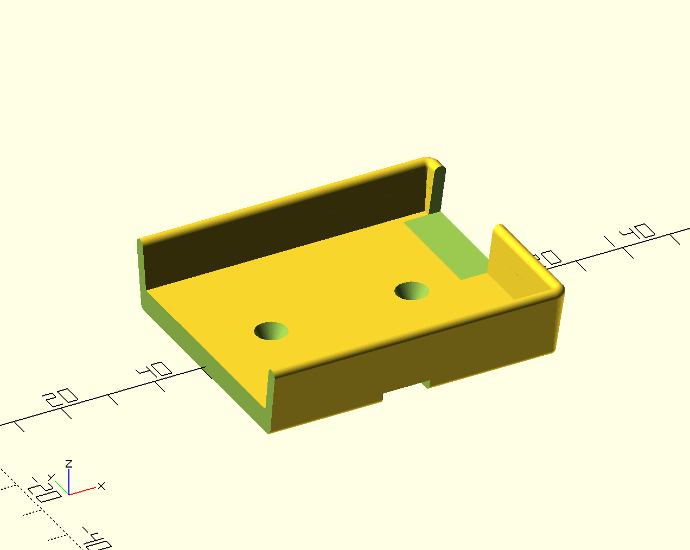

A holder for the lamps in the Haufen trailer
============================================

The discounter "Aldi" offered LED lamps with motion sensors. This lamps are
intended to use in a cupboard, but I wanted to mount them in the trailer of
the [Bunten Haufen](http://bunter-haufen.de).

This holder can be screwed with two M3 to a wall or ceiling and the lamp will
be attached using a zip tie. Of cause you'd need two holders for one lamp.

