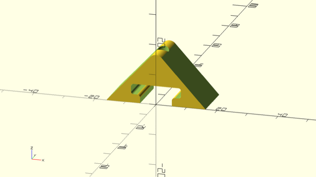
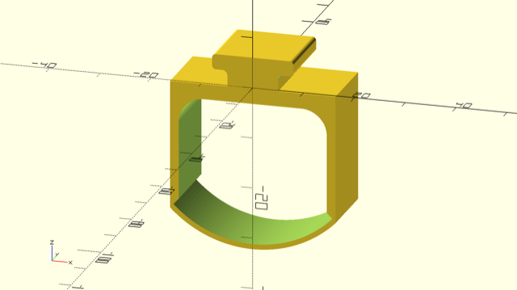
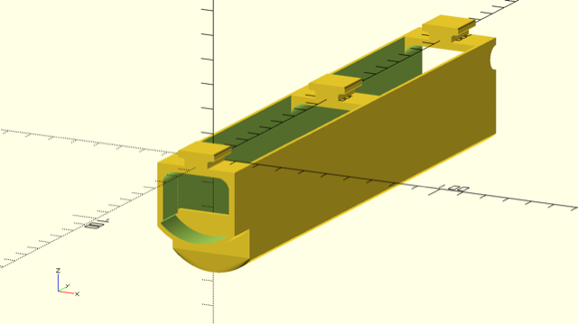
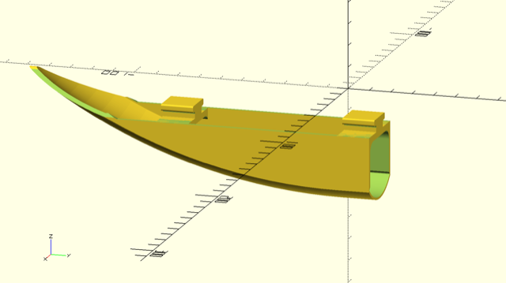
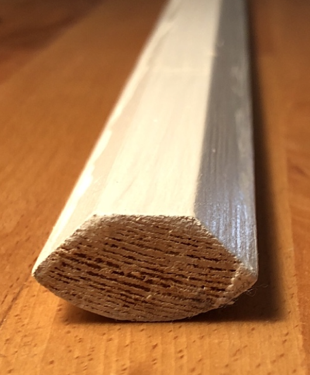
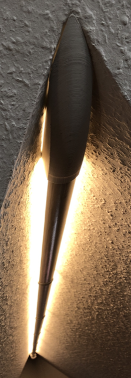

Lighting in Dwarfs Corner
=========================

I do have a low, long room in my flat we call "the dwarfs corner". This models
are designed to add led lighting to the room.

The finished 3d models consists of four parts.

1. The Screw Block
------------------

The screw block fits to the ceiling of the room and can be fixed with a screw.
It's the basis for the suspension of all other models.

2. The Wood Beam Holder
-----------------------

Suspension for the wood beam (see below), can be slid onto the screw block.

3. The Electronics Case
-----------------------

Holds all the electronics for controlling the LEDs, can be slid onto the
screw block.

4. The End Piece
----------------

Fits to the end of the roof of the dwarfs corner, can be slid onto the
screw block.

5. The Long Stretch (not a 3D model)
------------------------------------

For the finished lamp, I used a quarter-round wood beam to stretch the length
of 3 meters. The adhesive led stripe fittet perfectly on the flattened "inner"
part.

This is what the finished lamp looks like. Not the prettiest of all pictures.

