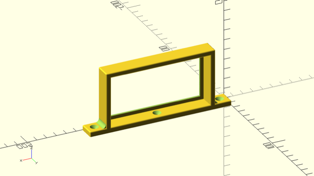

Mount for Power Bricks
======================

A mount for power bricks, size and other features can be specified as
pararmeters:

    mount(
        brick_width,
        brick_height,
        spax=4,
        rim=true,
        leeway=1,
        thickness=5,
        rim_thickness=2,
        rim_height=3,
        screw_wall=4,
        chamfer=1,
        )

Parameters:

 - `brick_width`: the width of the power brick
 - `brick_height`: the height of the power brick
 - `spax`: size of the screw (spax sizes ;-)
 - `rim`: add a rim as a stopper for the power brick
 - `leeway`: additional room given to the power brick size
 - `thickness`: thickness of the mount walls and plates
 - `rim_thickness`: thickness of the rim
 - `rim_height`: height of the rim
 - `screw_wall`: wall around the screw hole
 - `chamfer`: a rounded corner radius

The width of the mount is determined by the screw size and the `screw_wall`
parameter.

