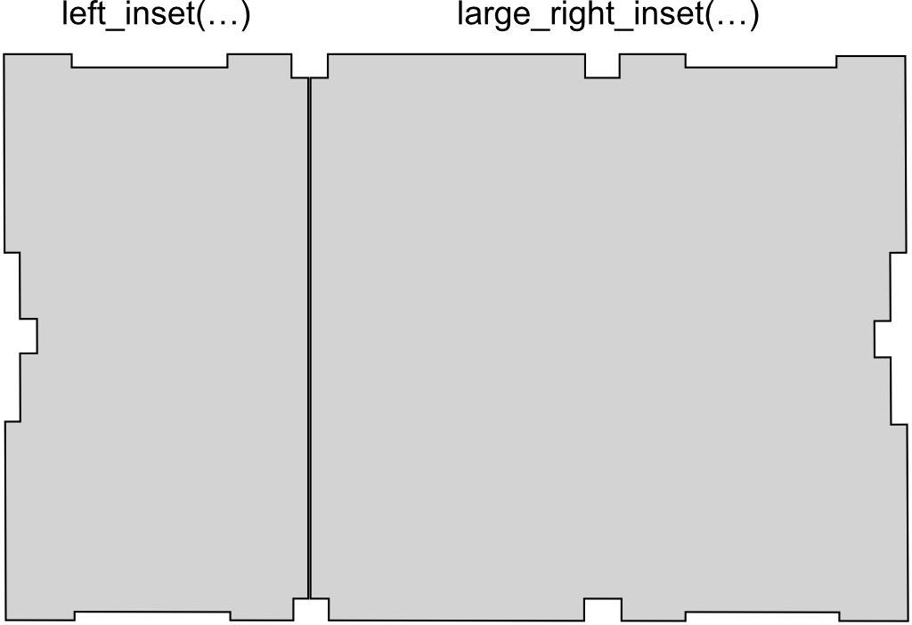

# L-Boxx Mini Insets

There are quite a few insets for the Sortimo L-Boxx Mini out there but none of
them fitted my needs:

- printable on my Prusa Mini
- easily configurable
- still being able to use the original dividers

My design is only possible due to the great work of member [6d6178@printables][6d6178],
who provided a [full inner volume model][inner_volume] of the L-Boxx Mini under
a Creative Commons license.

I used [OpenSCAD][openscad], so if you want to configure stuff to your own
needs, a little basic knowledge is helpful.


## Basic Idea

The orignial L-Boxx Mini is divided in three sections: left, middle and right.
For each section, there is a volumetric (filled) model available and the cutouts
are created as needed.


### The Insets

There are six types of insets:

- left
- middle
- right
- large left
- large right
- full (untested, doesn't fit on my printer bed)

For each inset, there is an OpenSCAD module that takes two parameters to
further configure the basic shape:

```
// example:
module left_inset(part=PART_FULL, connector=false) { … }
```

The parameter ```part``` defines the height of the inset. Available
options are:

- "full" (or constant ```PART_FULL```): complete z-height
- "lower" (or constant ```PART_LOWER```): the lower part of a stacked assembly
- "upper" (or constant ```PART_UPPER```): the upper part of a stacked assembly

If the parameter ```connector``` is set to true, a structure will be added to
the inset to attach an original divider from the L-Boxx Mini.

I *strongly suggest*, to print any upper inset *without connector*, even if you
have a lower inset with connector - it will be easier to take out the upper
inset and access items in lower one.


&nbsp;


&nbsp;



&nbsp;


### The cutouts

For each inset, there are eight cutouts defined:

- ```WELL_LEFT_1``` to ```WELL_LEFT_8```
- ```WELL_MIDDLE_1``` to ```WELL_MIDDLE_8```
- ```WELL_RIGHT_1``` to ```WELL_RIGHT_8```


The module ```well_form(…)``` creates the cutout model (with a nicely rounded
bottom) to be subtracted from the inset.

```
// example for the top left cutout form:
well_form(WELL_LEFT_1)
```

You can also specify a parameter ```to``` to created large (merged) cutouts:

```
// example for a large cutout form:
well_form(from=WELL_LEFT_4, to=WELL_MIDDLE_6)
```


## Finished Models

To get you started easily, there are already over 100 finished models ready to
be printed. Ok, I cheated a little bit. There are over 100 different variations
of basic models to get you started.

Please have a look in the folder "models"


## Customizations

If you are not happy with the predefined models, you can (and should) create
your own.

A good starting point is to open ```playground.scad``` and play around with
the different modules and settings.

You can achieve quite interesting cutout shapes by defining different ```from```
and ```to``` parameters. Have a look at ```example_inset_mixed.scad``` and the
corresponding stl file.

If you want to build up something from an empty base inset, the upper surface
of the cutout floor is conveniently located at z=0.

Have a look at the ```sortimo-insets.scad``` file, if you want to dig deeper.
Everything is defined there. It might not be pretty but it works.


## Example Pictures


### Printer and Slicer Settings

The prints above where made with 0.4mm nozzle and PETG filament.

I changed the default "0.25mm Draft @Mini" a little bit for this prints:

- Avoid crossing perimeters: true
- Fill density: 0%
- Fill pattern: Gyroid
- Infill/perimeters overlap: 25%


## License

This work is shared under Creative Commons (4.0 International License) Attribution-ShareAlike


[inner_volume]: https://www.printables.com/de/model/274527-bosch-sortimo-l-boxx-mini-inner-volume
[6d6178]: https://www.printables.com/de/@6d6178
[openscad]: https://openscad.org
