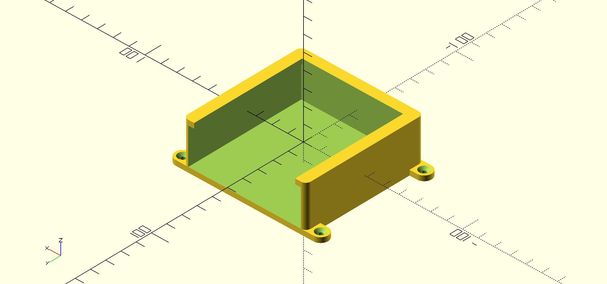

A case for screwing stuff to a wall
===================================

Sometimes you want to screw something to a wall without damaging it.

    wall_mount(
        box,
        slack=1,
        wall=3.2,
        screw=3,
        ears=true
        )

Parameters:

 - `box`: the size of the box you want to be mounted on the wall
 - `slack`: how much slack there should be between the box and the case
 - `wall`: thickness of the walls and base plate
 - `screw`: diameter of the screws you want to use
 - `ears`: if true, the screws are on the outside of the case

